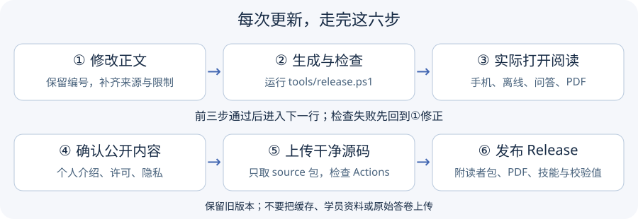

# 第一次发布与以后更新

本项目是公开源码的健身指南。正文与技能为 CC BY-NC 4.0，代码 MIT，字体 OFL；不能把整包说成可以任意商业使用。当前文件是本地候选，完成内容问答与 PDF 人工验收后再发布。

## 改一条与生成新版

打开 book/ 找到条目，保留 TB 编号，修改建议、例子及相关限制；新增来源要一起补核验记录。不要直接改 dist/ 或技能的生成副本。作者资料在 assets/profile.cjs；只填写真实并愿意公开的内容，contact 为 null 时不显示业务联系入口。

Windows：在项目文件夹空白处打开终端，执行 `powershell -File tools/release.ps1`。需 Node.js 20 以上、Python 及 tools/requirements-pdf.txt 中依赖。找不到 Python 时使用 `-PythonExe` 指定实际解释器。脚本生成候选文件，不会上传，也不代表问答或 PDF 人工验收通过。

流程：修改正文 → 生成与自动检查 → 实际问答、手机和 PDF 检查 → 打包候选 → 核对公开内容 → 发布。

检查报错时保留终端里的错误内容，先停止后续发布步骤；无需删除原有文件。`dist/public-release.json`指出读者包，`dist/source-release.json`指出源码包和独立技能包。正式PDF是`dist/HowToTrainBetter.pdf`。只发本轮清单指定的文件，旧文件夹留作备份。

## 首次 GitHub 发布

1. 自己登录 GitHub，启用双重验证并私下保存恢复码。不要把密码、令牌或恢复码交给制作助手或放进文件。
2. 确认真实账号、仓库名称、作者介绍和唯一业务联系入口；尚未提供的信息不使用占位符公开。
3. 使用 dist/source-release.json 指向的干净源码包建仓库，勿上传整个工作文件夹。原始答卷、私人案例、缓存与本机资料不在公开源码包内。
4. 首次上传后查看 Actions，确认云端检查通过。失败时先修正再发布；本地通过不等于云端已通过。
5. 创建 v0.9.0 Release，写清具体变化、适用范围、已知限制和许可。附读者包、PDF、技能包及对应 SHA-256；源码已在仓库，不重复上传内部工作目录。
6. 用未登录窗口确认能下载，打开下载来的 HTML、PDF 和技能包；另存一份异地备份。

目前没有预填仓库或下载地址。正式发布后将真实链接填入 README。初期使用仓库与 Release 交付即可；预约、支付网站另行规划。

## 更新与回退

更新 package.json 的版本号、CHANGELOG 和当前说明，重新执行构建、检查与打包。保留原版快照与许可，不覆盖旧 Release 的同名文件冒充未修改版本。回退时明确指向已验证的旧版本，告知哪些修正不再包含；涉及严重错误的旧版不能直接重新推荐。

GitHub 账户安全说明：[配置双重验证恢复方式](https://docs.github.com/en/authentication/securing-your-account-with-two-factor-authentication-2fa/configuring-two-factor-authentication-recovery-methods)。不要将恢复码写入仓库。
